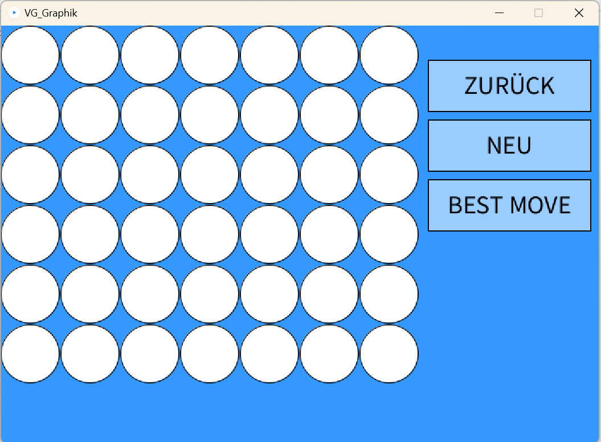
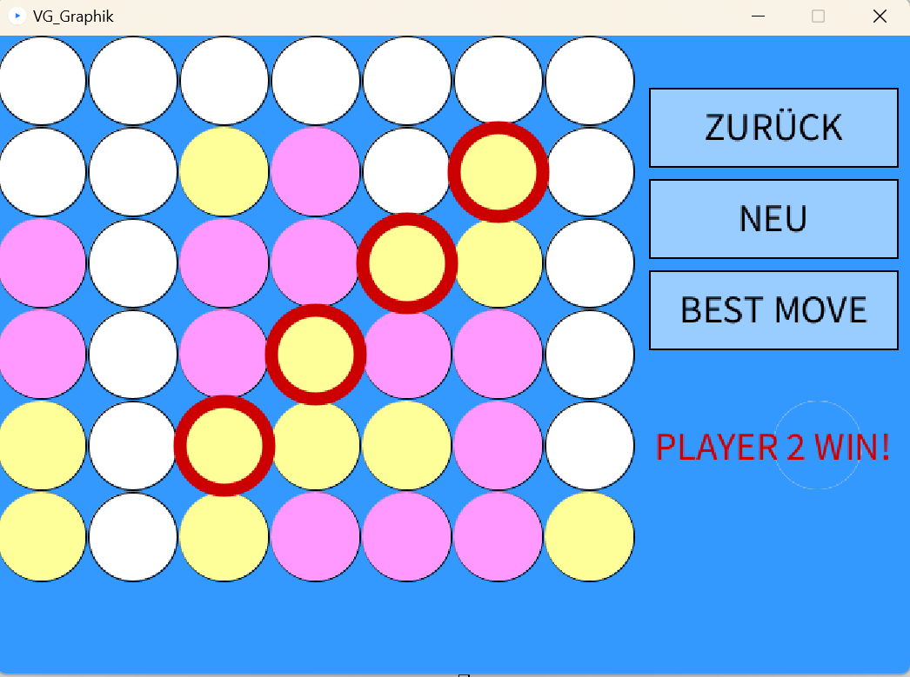
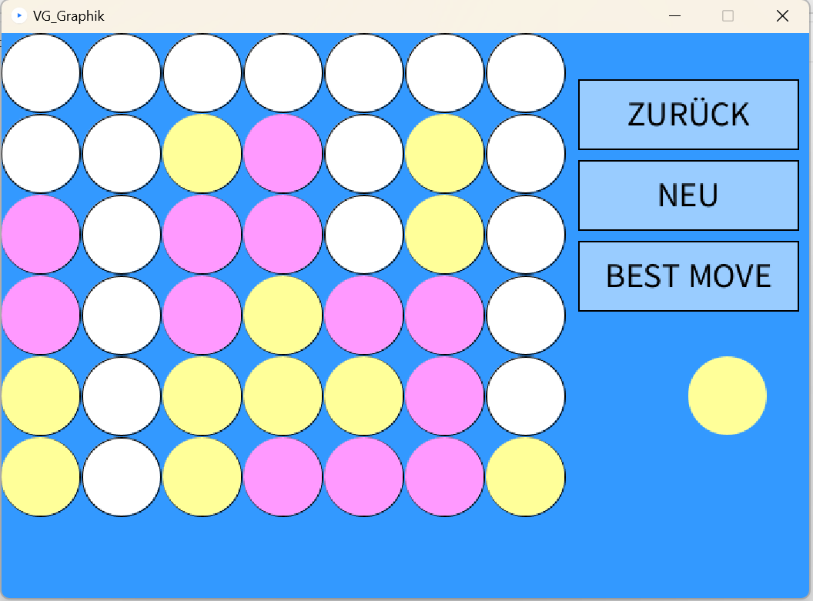

# Vier-Gewinn-Spiel
Implementierung des Vier-Gewinn-Spiels in Java und Visualisierung mittels Processing

## Beschreibung des Spiels

Das Spiel Vier-Gewinnt ist ein Strategiespiel für zwei Personen. Dafür gibt es ein Gitter 7x6 (7 Spalten und 6 Reihen) und zwei-färbige Spielersteine. Die Spieler lassen abwechselnd sein Stein in eine freie Spalte fallen. Die freie Spalte ist die Spalte, die nicht voll mit 6 Steinen ist. Das Spiel beendet, wenn eine Person vier Steine in eine Linie (diagonal, vertikal oder horizontal) kriegt oder alle Spalten voll sind. Die Spielzüge laufen durch die Methode *play(Move… columns)*.

Der beste Zug gibt die Spalte an, mit der der Spieler höchstwahrscheinlich gewinnen kann. Durch die **Negamax-** und **Monte-Carlo-Algorithmus** werden der Score für alle sieben Spalten bewertet. Welche, die das maximale Score hat, wird als den besten Zug gewählt. Dieser Schritt wird durch die Methoden *bestMove()*, *negamax(int depth)* und *monteCarlo_score()*
durchgeführt.

Beispiel für *bestMove()*:

Anschließend gibt es *undo()*-Methode, um die letzte Position in der *history*-Liste zurückzunehmen, und noch ein paar Hilfemethoden wie:

Beispiel für *undo()*:

- (static) *newGame()*: Erzeugt ein neues Spiel mit einer leeren *history*-Liste.
- *nextMoveScore()*: Speichert die Scores der 7 Spalten, um den beste Score in der *bestScore()*-Methode zu suchen. 
- *cango(int column)*: Prüft die Spalte, es voll ist. Wenn ja, gibt es falsch-Wert zurück. Die gewählte Spalte ist nicht akzeptiert.
- *getGrid()*: Erzeugt ein Gitter aus dem Spielverlauf (*history*-Liste).
- *getHistory()*: Gibt den Spielverlauf zurück.

## Beschreibung der Algorithmen
Im Projekt werden **Monte-Carlo-** und **Negamax-Algorithmus** genutzt, um den besten Zug zu finden.

**Monte-Carlo-Algorithmus** hilft bei der Evaluierung des Scores eines Zuges. Mit dem angegebenen Spielverlauf (*history*-Liste) berechnet die Methode die Wahrscheinlichkeit, dass der Spieler, zu dem der letzte Zug in der *history*-Liste gehört, gewinnen kann. Dabei läuft sie 400 Experimente und zählt die Gewinne. Diese Anzahl wird zu einem Score in [-10,10] umgerechnet. Bei den Game-Over-Fällen bekommt der Score die besondere Werte. Das Spiel beendet mit dem Sieg, nimmt es 10. Das Spiel ist unentschieden, nimmt es 5. 

**Negamax-Methode** gibt den Score an einem Spalte zurück. Es hängt von der Tiefe des rekursiven Aufrufs ab. Der Score ist von der **Monte-Carlo** berechnet. Nach jeder Tiefe wird das negative Maximum des Scores der besuchten Spalten mit einem maximalen Wert (*value*) verglichen. Wenn es größer ist, speichert *value* dieses Maximum für den nächsten Vergleich ab. Die *history*-Liste wird nach jedem Aufruf geändert, weil sie einen neuen Wert (Position genannt) speichern muss, um das für **Monte-Carlo** benötigte Gitter zu erzeugen. Nach der Rückgabe des Scores wird diese Position gelöscht (mithilfe der *undo()*-Methode).
Es gibt besondere Fälle, wobei der Score anders gerechnet ist wie:
- Der Stein kann nicht an die Spalte geworfen werden, weil sie voll ist: Score = -20
- Der Stein wird an die Spalte geworfen, dabei der Spieler gewinnen kann: Score = 10 (automatiscsh, nicht durch **Monte-Carlo**)
- Der Stein wird an die Spalte geworfen, dabei der Gegner im nächsten Zug gewinnen kann: Score = -15

## Erklärung des Logging-Protokolls
Lesen Sie bitte [README (PiS, SoSe2022).pdf](https://github.com/ngdqtram99/Vier-Gewinn-Spiel/blob/main/README%20(PiS%2C%20SoSe2022).pdf)

## Libraries
Processing [Version 3.5.4](https://processing.org/releases)

## Tools
Java [Java™ SE Development Kit 17.0.2 (JDK 17.0.2)](https://www.oracle.com/java/technologies/javase/17-0-2-relnotes.html)

JUnit 5 [Version 5.7.0](https://junit.org/junit5/docs/5.7.0/release-notes/index.html)

